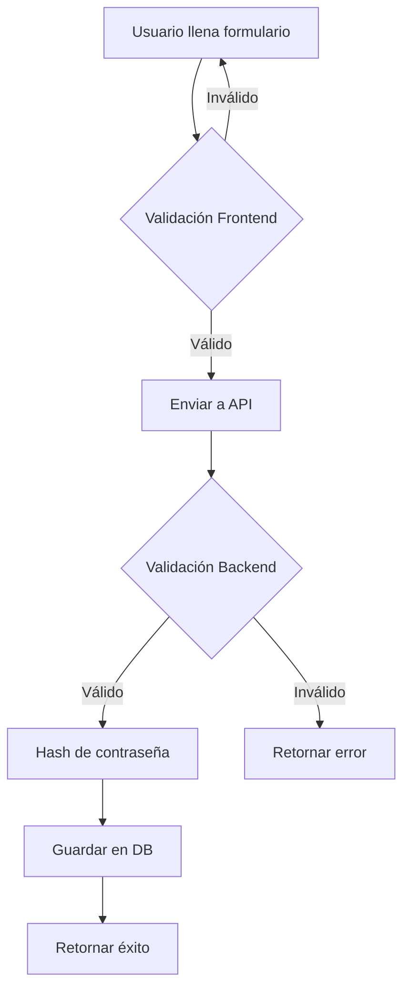
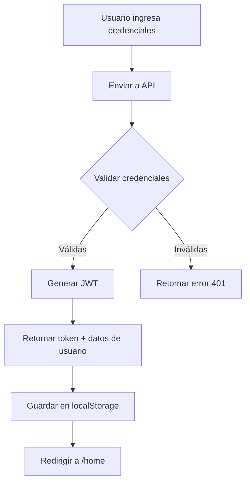
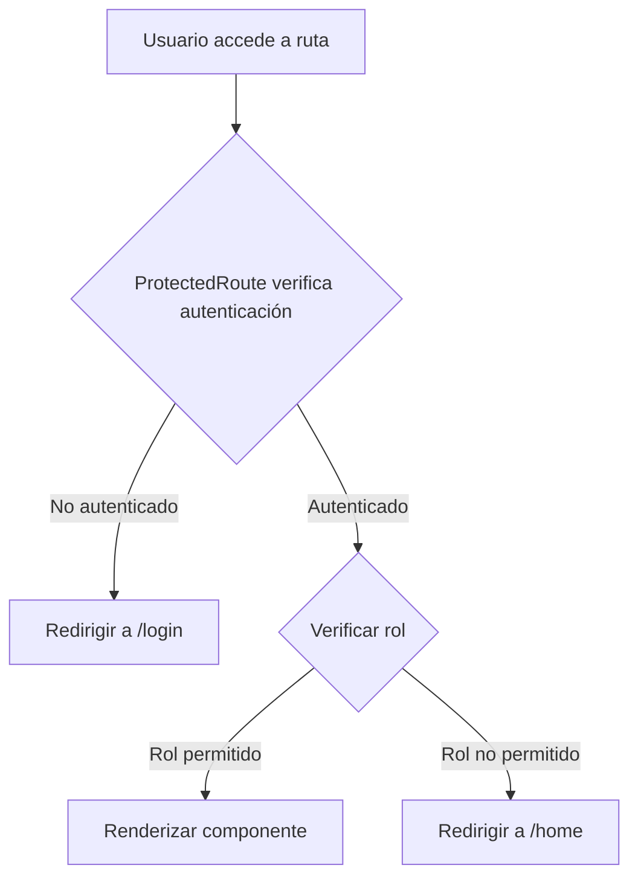

# 🔐 Sistema de Roles y Seguridad - EduSoft Language

## 📋 Resumen Ejecutivo

Este documento describe la implementación completa de un sistema de roles y seguridad para la aplicación web EduSoft Language, siguiendo las mejores prácticas de desarrollo seguro.

## 🏗️ Arquitectura del Sistema

### Backend (Node.js + TypeScript + Prisma)

#### Estructura de Capas

```
Back/
├── src/
│   ├── middleware/
│   │   ├── auth.ts          # Autenticación JWT
│   │   └── authorize.ts     # Autorización por roles
│   ├── controllers/
│   │   ├── user-ctrl.ts     # Controladores de usuario
│   │   └── admin-ctrl.ts    # Controladores de administración
│   ├── routes/
│   │   └── user.ts          # Rutas con middlewares
│   └── utils/
│       └── security.ts      # Utilidades de seguridad
├── prisma/
│   └── schema.prisma        # Esquema de base de datos
├── index.ts                 # Servidor principal
└── .env                     # Variables de entorno
```

### Frontend (React + Vite)

#### Estructura de Componentes

```
Front/
├── src/
│   ├── components/
│   │   ├── ProtectedRoute.jsx    # Protección de rutas
│   │   └── RoleBadge.jsx         # Badge de roles
│   ├── context/
│   │   └── AuthContext.jsx       # Context de autenticación
│   ├── pages/
│   │   └── admin/
│   │       └── AdminDashboard.jsx # Panel de administración
│   ├── utils/
│   │   └── validation.js         # Validaciones de cliente
│   └── API.js                     # Cliente HTTP con interceptores
```

## 🔑 Sistema de Roles

### Jerarquía de Roles

1. **ADMIN** 👑

   - Acceso total al sistema
   - Gestión de usuarios y roles
   - Visualización de estadísticas

2. **TUTOR** 🎓

   - Visualización de estadísticas
   - Acceso a contenido educativo avanzado

3. **STUDENT_PRO** ⭐

   - Acceso a contenido premium
   - Funcionalidades avanzadas

4. **STUDENT_FREE** 📚
   - Acceso básico a la plataforma
   - Rol predeterminado para nuevos usuarios

### Implementación en Base de Datos

```prisma
enum Role {
  ADMIN
  TUTOR
  STUDENT_PRO
  STUDENT_FREE
}

model User {
  id             String        @id @default(cuid())
  email          String        @unique
  username       String
  password       String        // Hasheado con bcrypt
  answerSecret   String        // Hasheado con bcrypt
  role           Role          @default(STUDENT_FREE)
  createdAt      DateTime      @default(now())
  updatedAt      DateTime      @updatedAt
  profilePicture String        @default("default-profile-picture.jpg")
  gameHistory    GameHistory[]
}
```

## 🛡️ Medidas de Seguridad Implementadas

### Backend

#### 1. Autenticación JWT

- **Implementación**: `Back/src/middleware/auth.ts`
- **Algoritmo**: HS256 (HMAC with SHA-256)
- **Expiración**: 7 días (configurable en `.env`)
- **Payload**:
  ```typescript
  {
    userId: string,
    role: string,
    exp: number,  // Timestamp de expiración
    iat: number   // Timestamp de emisión
  }
  ```

#### 2. Hashing de Contraseñas

- **Biblioteca**: bcrypt
- **Salt Rounds**: 10
- **Ubicación**: `Back/src/utils/security.ts`
- **Funciones**:
  - `hashPassword(password: string)`: Hash de contraseñas
  - `comparePassword(password: string, hash: string)`: Comparación segura

#### 3. Validación de Entrada

**Validaciones Implementadas**:

- ✅ Formato de email válido
- ✅ Fortaleza de contraseña (mínimo 8 caracteres, mayúscula, minúscula, número)
- ✅ Sanitización de inputs (eliminación de caracteres peligrosos)
- ✅ Límite de longitud de campos

**Código**:

```typescript
export const isStrongPassword = (password: string): boolean => {
  const passwordRegex = /^(?=.*[a-z])(?=.*[A-Z])(?=.*\d).{8,}$/;
  return passwordRegex.test(password);
};
```

#### 4. Configuración CORS

```typescript
app.use(
  cors({
    origin: (origin, callback) => {
      if (!origin || corsOrigins.includes(origin)) {
        callback(null, true);
      } else {
        callback(new Error("Not allowed by CORS"));
      }
    },
    credentials: true,
    methods: ["GET", "POST", "PUT", "DELETE", "OPTIONS"],
    allowedHeaders: ["Content-Type", "Authorization"],
  })
);
```

#### 5. Variables de Entorno

**Archivo**: `Back/.env`

```env
DATABASE_URL="postgresql://..."
JWT_SECRET="your-super-secret-jwt-key"
JWT_EXPIRATION="7d"
PORT=3000
CORS_ORIGINS="http://localhost:5173,http://localhost:4173"
NODE_ENV="development"
```

### Frontend

#### 1. Interceptores HTTP (Axios)

**Ubicación**: `Front/src/API.js`

**Request Interceptor**:

```javascript
api.interceptors.request.use((config) => {
  const token = localStorage.getItem("token");
  if (token) {
    config.headers.Authorization = `Bearer ${token}`;
  }
  return config;
});
```

**Response Interceptor**:

```javascript
api.interceptors.response.use(
  (response) => response,
  (error) => {
    if (error.response?.status === 401) {
      // Auto-logout en caso de token expirado
      localStorage.removeItem("token");
      localStorage.removeItem("user");
      window.location.href = "#/login";
    }
    return Promise.reject(error);
  }
);
```

#### 2. Protección de Rutas

**Componente**: `Front/src/components/ProtectedRoute.jsx`

```jsx
<ProtectedRoute allowedRoles={["ADMIN", "TUTOR"]}>
  <AdminDashboard />
</ProtectedRoute>
```

#### 3. Validación de Contraseñas (Cliente)

**Ubicación**: `Front/src/utils/validation.js`

**Características**:

- ✅ Validación en tiempo real
- ✅ Indicador visual de fortaleza
- ✅ Mensajes de error descriptivos

#### 4. Auto-logout por Expiración

**Implementación**: `Front/src/context/AuthContext.jsx`

```javascript
useEffect(() => {
  const checkTokenExpiration = () => {
    const token = localStorage.getItem("token");
    if (token) {
      const decoded = jwtDecode(token);
      if (decoded.exp < Date.now() / 1000) {
        logout();
      }
    }
  };
  const interval = setInterval(checkTokenExpiration, 5 * 60 * 1000);
  return () => clearInterval(interval);
}, []);
```

## 📡 API Endpoints

### Rutas Públicas (Sin Autenticación)

| Método | Endpoint                 | Descripción                |
| ------ | ------------------------ | -------------------------- |
| POST   | `/user/create`           | Registro de usuario        |
| POST   | `/user/login`            | Inicio de sesión           |
| POST   | `/user/recover-password` | Recuperación de contraseña |

### Rutas Protegidas (Requieren JWT)

| Método | Endpoint               | Roles | Descripción                  |
| ------ | ---------------------- | ----- | ---------------------------- |
| PUT    | `/user/update-profile` | Todos | Actualizar perfil            |
| POST   | `/user/game-history`   | Todos | Guardar historial de juego   |
| GET    | `/user/progress`       | Todos | Obtener progreso del usuario |
| GET    | `/user/ranking`        | Todos | Obtener ranking              |

### Rutas de Administración

| Método | Endpoint                     | Roles        | Descripción               |
| ------ | ---------------------------- | ------------ | ------------------------- |
| GET    | `/user/admin/users`          | ADMIN        | Listar todos los usuarios |
| PUT    | `/user/admin/users/:id/role` | ADMIN        | Cambiar rol de usuario    |
| GET    | `/user/admin/stats`          | ADMIN, TUTOR | Estadísticas del sistema  |

## 🎯 Flujos de Autenticación

### Registro de Usuario



### Login de Usuario



### Acceso a Ruta Protegida



## 🔧 Configuración y Deployment

### Prerequisitos

- Node.js >= 18
- PostgreSQL >= 14
- Bun (opcional, para desarrollo)

### Instalación Backend

```bash
cd Back
bun install  # o npm install
```

### Migración de Base de Datos

```bash
cd Back
npx prisma migrate dev --name add-roles
npx prisma generate
```

### Instalación Frontend

```bash
cd Front
npm install
```

### Ejecución en Desarrollo

```bash
# Backend
cd Back
bun run dev

# Frontend
cd Front
npm run dev
```

## 🧪 Testing

### Crear Usuario Admin Manualmente

```bash
cd Back
npx prisma studio
# Editar usuario y cambiar role a "ADMIN"
```

### Probar Endpoints con Autenticación

```bash
# Login para obtener token
curl -X POST http://localhost:3000/user/login \
  -H "Content-Type: application/json" \
  -d '{"email":"admin@example.com","password":"Admin123"}'

# Usar token en peticiones protegidas
curl -X GET http://localhost:3000/user/admin/users \
  -H "Authorization: Bearer <TOKEN>"
```

## 📚 Buenas Prácticas Implementadas

### Seguridad

✅ Contraseñas nunca se almacenan en texto plano  
✅ Tokens JWT con expiración  
✅ Validación de entrada en cliente y servidor  
✅ CORS configurado correctamente  
✅ Variables de entorno para secretos  
✅ Sanitización de inputs

### Código Limpio

✅ Separación de responsabilidades (MVC)  
✅ Middleware reutilizables  
✅ Tipos TypeScript para seguridad de tipos  
✅ Comentarios y documentación  
✅ Manejo consistente de errores

### UX/UI

✅ Indicador de fortaleza de contraseña  
✅ Mensajes de error descriptivos  
✅ Auto-logout por expiración de sesión  
✅ Badges visuales de roles  
✅ Navegación adaptativa por rol

## 🚀 Próximos Pasos Recomendados

1. **Refresh Tokens**: Implementar sistema de refresh tokens para sesiones más largas
2. **Rate Limiting**: Agregar límite de intentos de login
3. **2FA**: Autenticación de dos factores
4. **Logging**: Sistema de logs para auditoría
5. **Tests**: Pruebas unitarias y de integración
6. **Email Verification**: Verificación de email al registrarse
7. **Password Reset**: Sistema completo de recuperación por email
8. **Sesiones Activas**: Gestión de sesiones múltiples

## 👨‍💻 Desarrollado por

Arquitecto Full-Stack Senior - Sistema de Roles y Seguridad  
Fecha: Diciembre 2025

---

**Nota**: Este sistema está diseñado para ser escalable y mantenible. Todas las contraseñas están hasheadas con bcrypt y nunca se almacenan en texto plano.
